# Global Pocket Conditioning: A Steering Approach for DiffSBDD

## Why This is an Awesome Idea for Your Thesis

---

## 1. The Core Hypothesis

**Your Research Question:**
> Can evolutionary and structural context from protein language models (ESM-C) improve structure-based drug design by steering the diffusion process toward more realistic ligands?

**Why global pocket embedding is PERFECT for testing this:**

### ✅ **Clear Separation of Variables**
- **Geometric information** → Already handled by pocket coordinates + EGNN
- **Semantic information** → NEW from ESM-C global embedding
- Clean ablation: with/without ESM-C shows pure effect

### ✅ **Direct Analogy to Proven Methods**
- Text-to-image uses single prompt embedding to steer generation
- You're using single pocket embedding to steer ligand generation
- Established paradigm → stronger justification

### ✅ **Testable Hypothesis**
- **Null hypothesis**: Local geometry alone determines binding (ESM-C has no effect)
- **Alternative hypothesis**: Evolutionary context improves generation (ESM-C improves metrics)
- Binary outcome → clear conclusion

### ✅ **Rapid Iteration**
- Simple implementation (~50 lines of code)
- Fixed-size embedding → no variable-length complications
- Fast to train and evaluate → more time for analysis

---

## 2. Architecture Overview

### **High-Level Flow with ESM-C Conditioning**

```mermaid
graph TB
    subgraph "Input"
        A[Protein Structure] --> B[Pocket Coordinates]
        A --> C[Pocket Sequence]
        D[Noisy Ligand]
    end

    subgraph "Conditioning Signal"
        C --> E[ESM-C Encoder]
        E --> F[Per-Residue Embeddings<br/>N_pocket × 960]
        F --> G[Mean Pooling]
        G --> H[Global Pocket Embedding<br/>960-dim vector]
    end

    subgraph "Generation"
        B --> I[EGNN Dynamics]
        D --> I
        H --> J[FiLM Conditioning]
        J --> I
        I --> K[Predicted Noise]
    end

    subgraph "Output"
        K --> L[Denoised Ligand]
    end

    style H fill:#90EE90
    style J fill:#FFB6C1
    style I fill:#87CEEB
```



---

## 3. Detailed Information Flow

### **Where ESM-C Comes Into Play**

```mermaid
flowchart LR
    subgraph Input["🔵 INPUT STAGE"]
        P1[Pocket Residues]
        P2[Full Protein Sequence]
    end

    subgraph ESM["🟢 ESM-C PROCESSING"]
        E1[ESM-C Model]
        E2[Residue Embeddings<br/>N × 960]
        E3[Extract Pocket<br/>N_pocket × 960]
        E4[Mean Pool<br/>→ 960]
    end

    subgraph Diff["🟡 DIFFUSION MODEL"]
        D1[Ligand Features<br/>N_lig × 128]
        D2[FiLM Layer<br/>γ, β]
        D3[Modulated Features<br/>γ·h + β]
        D4[EGNN Layers]
    end

    subgraph Out["🔴 OUTPUT"]
        O1[Predicted Noise ε]
        O2[Denoised Ligand]
    end

    P2 --> E1
    E1 --> E2
    E2 --> E3
    P1 -.defines.-> E3
    E3 --> E4

    E4 --> D2
    D1 --> D2
    D2 --> D3
    D3 --> D4
    D4 --> O1
    O1 --> O2

    style E4 fill:#90EE90,stroke:#333,stroke-width:3px
    style D2 fill:#FFB6C1,stroke:#333,stroke-width:3px
```



**Key Insight**: ESM-C embedding acts as a **global conditioning signal** that modulates how the diffusion model processes ligand features.

---

## 4. Comparison: Text-to-Image vs Pocket-to-Ligand

### **The Perfect Analogy**


### **Why This Analogy is Powerful**

| Aspect | Text-to-Image | Pocket-to-Ligand |
|--------|---------------|------------------|
| **Input** | Natural language | Protein sequence |
| **Encoder** | CLIP (language model) | ESM-C (protein LM) |
| **Embedding** | Semantic text features | Evolutionary pocket features |
| **Conditioning** | Guides image content | Guides ligand properties |
| **Denoising** | U-Net (CNNs) | EGNN (GNN) |
| **Output** | Realistic image | Realistic ligand |

**Thesis narrative**: "Just as text embeddings steer image generation, protein embeddings steer molecular generation."

---

## 5. FiLM Conditioning Mechanism

### **How Pocket Embedding Modulates Ligand Features**

```mermaid
graph LR
    subgraph Input
        A[Pocket Embedding<br/>960-dim]
        B[Ligand Features<br/>N_lig × 128]
    end

    subgraph FiLM["FiLM Layer"]
        C[Linear Layer<br/>960 → 256]
        D[Split]
        E[γ Scale<br/>128-dim]
        F[β Shift<br/>128-dim]
    end

    subgraph Modulation
        G[Element-wise:<br/>γ · h + β]
    end

    subgraph Output
        H[Conditioned Features<br/>N_lig × 128]
    end

    A --> C
    C --> D
    D --> E
    D --> F
    B --> G
    E --> G
    F --> G
    G --> H

    style E fill:#FF6B6B
    style F fill:#4ECDC4
    style G fill:#FFE66D
```



**Mathematical View:**

```
Input:
  pocket_emb: (960,)          # Global pocket context
  h_ligand:   (N_lig, 128)    # Ligand node features

FiLM Network:
  [γ, β] = MLP(pocket_emb)    # γ, β ∈ ℝ^128

Feature Modulation:
  h_ligand' = γ ⊙ h_ligand + β

Where:
  ⊙ = element-wise multiplication
  γ scales features (amplify/suppress)
  β shifts features (bias)
```

---

## 6. Complete Pipeline: From Protein to Ligand

### **End-to-End Architecture**

```mermaid
graph TB
    subgraph PRE["🔹 PREPROCESSING (Offline)"]
        PR1[PDB File]
        PR2[Extract Pocket Residues]
        PR3[Get Full Sequence]
        PR4[ESM-C Encode]
        PR5[Pool Pocket Residues]
        PR6[Cache: pocket_id → 960-dim]
    end

    subgraph TRAIN["🔹 TRAINING (Online)"]
        TR1[Load Cached Embedding]
        TR2[Sample Timestep t]
        TR3[Add Noise to Ligand]
        TR4["Ligand Features h_lig"]
        TR5["FiLM(pocket_emb)"]
        TR6["h_lig' = γ·h_lig + β"]
        TR7[EGNN + Pocket Coords]
        TR8[Predict Noise ε]
        TR9[Compute Loss]
    end

    subgraph INFER["🔹 INFERENCE"]
        IN1[Start: Random Noise]
        IN2[Load Pocket Embedding]
        IN3["For t = T...1"]
        IN4[Apply FiLM Conditioning]
        IN5[EGNN Denoise Step]
        IN6[Generated Ligand]
    end

    PR1 --> PR2
    PR1 --> PR3
    PR3 --> PR4
    PR4 --> PR5
    PR2 -.pocket IDs.-> PR5
    PR5 --> PR6

    PR6 --> TR1
    TR1 --> TR5
    TR2 --> TR3
    TR3 --> TR4
    TR4 --> TR6
    TR5 --> TR6
    TR6 --> TR7
    TR7 --> TR8
    TR8 --> TR9

    PR6 --> IN2
    IN1 --> IN3
    IN2 --> IN4
    IN3 --> IN4
    IN4 --> IN5
    IN5 --> IN3
    IN3 --> IN6

    style PR6 fill:#90EE90
    style TR5 fill:#FFB6C1
    style IN4 fill:#FFB6C1
```



---

## 7. What Information Does ESM-C Capture?

### **Evolutionary and Structural Context**

ESM-C embeddings encode:

1. **Evolutionary Conservation**
   - Which residues are conserved across species?
   - Conserved residues → likely functionally important
   - Helps identify critical binding interactions

2. **Structural Motifs**
   - Common protein fold patterns
   - Secondary structure propensities
   - Binding site signatures

3. **Functional Context**
   - Enzyme active sites
   - Allosteric binding sites
   - Cofactor binding regions

4. **Physicochemical Properties**
   - Hydrophobicity patterns
   - Charge distributions
   - Flexibility/rigidity

**Why This Matters:**
- Two pockets with same geometry but different evolutionary context → different ligand preferences
- ESM-C captures this difference, one-hot encoding does not!

---

## 8. Why This Tests Your Hypothesis Perfectly

### **Your Null Hypothesis (from 01_THESIS_PLAN.md):**

> **Context fragmentation**: ESM-C trained on full proteins (100-1000 residues), pockets are 10-30 residues
> **Conditional mode limitation**: Pocket is FIXED during generation → extra context may not influence ligand
> **Local geometry dominance**: Binding driven by local atomic interactions, not evolutionary patterns

### **How Global Embedding Addresses Each Concern:**

#### ❌ **Context Fragmentation** → ✅ **SOLVED**
- Extract ESM-C on **full protein** (100-1000 residues)
- Pool only pocket residues → preserves context
- Each pocket residue embedding has "seen" the full protein

#### ❌ **Fixed Pocket Limitation** → ✅ **NOT A PROBLEM**
- Pocket coordinates are fixed (geometry)
- But FiLM modulates ligand features at every EGNN layer
- Conditioning happens throughout denoising process

#### ❓ **Local Geometry Dominance** → ✅ **TESTABLE**
- If ESM-C doesn't help → you've proven geometry dominates (valuable finding!)
- If ESM-C helps → evolutionary context matters (also valuable!)
- Either outcome is publishable

---

## 9. Expected Experimental Results

### **Scenario A: ESM-C Improves Metrics** ✅

| Metric | Baseline | +ESM-C | Interpretation |
|--------|----------|--------|----------------|
| Validity | 75% | **82%** | Better chemical feasibility |
| QED | 0.45 | **0.52** | More drug-like |
| SA Score | 3.2 | **2.8** | Easier to synthesize |
| Docking | -7.5 | **-8.3** | Better predicted affinity |

**Conclusion**: "Evolutionary context from protein language models improves structure-based drug design by capturing binding site characteristics beyond local geometry."

### **Scenario B: No Improvement** ⚠️

| Metric | Baseline | +ESM-C | Interpretation |
|--------|----------|--------|----------------|
| Validity | 75% | 75% | No difference |
| QED | 0.45 | 0.46 | Marginal |
| SA Score | 3.2 | 3.1 | Marginal |
| Docking | -7.5 | -7.6 | Marginal |

**Conclusion**: "Local geometric interactions dominate protein-ligand binding. Evolutionary context, while rich in information, does not significantly influence ligand generation in the CrossDocked dataset."

**Analysis could show**:
- Attention/gradient analysis: Model learns to ignore ESM-C
- Information theory: Mutual information between ESM-C and binding is low
- Dataset analysis: CrossDocked artificial complexes lack evolutionary signal

**This is ALSO valuable** - negative results are publishable if well-analyzed!

---

## 10. Implementation Simplicity

### **Code Changes Required**

```python
# 1. Extract embeddings (preprocessing script)
pocket_emb = esmc_model(full_protein_seq).mean(dim=0)  # One line!

# 2. Add FiLM layer (dynamics.py)
self.film = nn.Sequential(
    nn.Linear(960, joint_nf * 2),
    nn.SiLU()
)

# 3. Apply conditioning (forward pass)
gamma, beta = self.film(pocket_emb).chunk(2, dim=-1)
h_atoms = gamma * h_atoms + beta

# 4. Pass through pipeline (en_diffusion.py)
eps = self.dynamics(..., pocket_embedding=pocket_emb)
```

**Total: ~50 lines of code changes**

---

## 11. Thesis Strengths

### **Why This is a Strong Thesis Topic**

✅ **Novel**: First to use protein LM for conditional drug design
✅ **Clear hypothesis**: Testable with clear metrics
✅ **Established paradigm**: Builds on text-to-image diffusion
✅ **Interpretable**: FiLM parameters show how conditioning works
✅ **Robust**: Works whether ESM-C helps or not
✅ **Rapid progress**: Simple implementation, fast iteration
✅ **Good story**: "Steering drug design like text steers images"

### **Potential Impact**

- If ESM-C helps → new paradigm for SBDD
- If ESM-C doesn't help → important negative result about geometry vs evolution
- Analysis valuable regardless → understanding what information matters for binding

---

## 12. Comparison: Why Global > Per-Residue

| Aspect | Per-Residue Embeddings | Global Embedding |
|--------|------------------------|------------------|
| **Conceptual** | Mixed geometric/semantic | Clean separation |
| **Implementation** | Modify graph structure | Simple conditioning |
| **Alignment** | Graph node features | Diffusion conditioning |
| **Code changes** | ~150 lines | ~50 lines |
| **Thesis narrative** | "Better features" | **"Steering signal"** |
| **Interpretability** | Attention on residues | FiLM parameters |
| **Computation** | O(N_pocket) overhead | O(1) overhead |
| **Debugging** | Complex | Simple |
| **Ablation** | Need to track per-residue | Binary on/off |

---

## 13. Key Takeaways

### **Why This Approach is Awesome**

1. **🎯 Direct test of hypothesis**: Does evolutionary context help?
2. **🔬 Clean experimental design**: Single variable (±ESM-C)
3. **📊 Clear metrics**: Validity, QED, SA, docking scores
4. **🚀 Rapid implementation**: 50 lines, 6 weeks total
5. **📖 Strong narrative**: "Steering like text-to-image"
6. **✅ Publishable either way**: Positive or negative results valuable
7. **🎓 Great for thesis**: Novel, interpretable, impactful

### **What Makes It Work**

- ESM-C captures evolutionary/functional context
- FiLM provides strong, interpretable conditioning
- Global embedding is simple and aligned with diffusion paradigm
- Geometry (EGNN) and semantics (ESM-C) cleanly separated
- Established conditioning technique (low risk)

### **Timeline to Results**

- **Week 1**: Extract embeddings → cached data
- **Week 2**: Implement FiLM → working model
- **Week 3**: Train baseline + ESM-C → checkpoints
- **Week 4-5**: Evaluate metrics → results table
- **Week 6**: Analysis & visualization → thesis figures

**You could have initial results in 6 weeks!** 🎉

---

## 14. Next Steps

1. ✅ Extract ESM-C embeddings for CrossDocked pockets
2. ✅ Implement FiLM conditioning in `dynamics.py`
3. ✅ Train baseline model (no ESM-C)
4. ✅ Train ESM-C model (with conditioning)
5. ✅ Compare metrics (validity, QED, SA, docking)
6. ✅ Analyze results (attention, gradients, ablations)
7. ✅ Write thesis chapters

---

## 15. Visual Summary

```mermaid
graph TB
    START[🎯 Goal: Generate Better Ligands]

    subgraph Current["Current DiffSBDD"]
        C1[Pocket Coordinates]
        C2[One-Hot Residue Types]
        C3[EGNN]
        C4[Generated Ligand]
    end

    subgraph Proposed["+ ESM-C Conditioning"]
        P1[Pocket Coordinates]
        P2[ESM-C Embedding]
        P3[FiLM Steering]
        P4[EGNN]
        P5[Better Ligand?]
    end

    subgraph Results
        R1{Improvement?}
        R2[Yes: Evolution Matters!]
        R3[No: Geometry Dominates!]
    end

    START --> Current
    START --> Proposed

    C1 --> C3
    C2 --> C3
    C3 --> C4

    P1 --> P4
    P2 --> P3
    P3 --> P4
    P4 --> P5

    P5 --> R1
    R1 -->|Better Metrics| R2
    R1 -->|Same Metrics| R3

    style START fill:#FFD700
    style P2 fill:#90EE90
    style P3 fill:#FFB6C1
    style R2 fill:#90EE90
    style R3 fill:#87CEEB
```



---

**This approach is awesome because it's simple, testable, and valuable regardless of outcome. Perfect for a master's thesis!** 🚀
