# Master Thesis Plan: Protein Context Conditioning for Structure-Based Drug Design

> **Core Idea**: Just as text embeddings steer image generation in Stable Diffusion, protein language model embeddings can steer molecular generation in DiffSBDD.

---

## 📚 Documentation Guide

**This document (THESIS_PLAN.md)** is the single source of truth for the thesis project.

### Quick Navigation

| Document | Purpose | When to Use |
|----------|---------|-------------|
| **THESIS_PLAN.md** (this file) | Master plan: research question, architecture, evaluation | Start here - complete overview |
| **implementation_plan.md** | Day-by-day implementation with validation experiments | When implementing code |
| **CONFIGURATION_GUIDE.md** | Baseline vs ESM-C mode configuration & backward compatibility | When writing code that supports both modes |
| **06_GLOBAL_POCKET_CONDITIONING.md** | Detailed explanation of global conditioning approach | Understanding the architecture choice |
| **IN_DEPTH_EXPLANATION.md** | Detailed codebase analysis and integration points | Understanding existing DiffSBDD code |

### Core Analogy

```
Text Prompt → CLIP → Stable Diffusion → Image
     ↓           ↓            ↓            ↓
Pocket Seq  →  ESM-C  →   DiffSBDD   →  Ligand
```

**Key Insight**: Single global 960-dim ESM-C embedding per pocket as steering signal via FiLM conditioning.

---

## 1. Research Question

**Can evolutionary and structural context from protein language models (ESM-C) improve structure-based drug design by providing a global steering signal to the diffusion process?**

### Hypothesis
A **single global pocket embedding** from ESM-C (960-dimensional vector) provides complementary information to local geometric features, steering ligand generation toward:
- More realistic molecular structures
- Better binding affinity
- Improved drug-like properties

### Null Hypothesis (What Might Not Work)
- **Local geometry dominance**: Binding is determined purely by local atomic interactions
- **Context fragmentation**: ESM-C trained on full proteins may not capture pocket-specific information
- **Dataset limitations**: CrossDocked contains artificial complexes that may lack evolutionary signal

**Key Insight**: Either outcome is valuable - proving or disproving the hypothesis contributes to understanding what information matters for binding!

---

## 2. The Text-to-Image Analogy

### Why This Framing is Powerful

| Text-to-Image (Stable Diffusion) | Pocket-to-Ligand (DiffSBDD + ESM-C) |
|----------------------------------|-------------------------------------|
| **Input**: Text prompt | **Input**: Protein pocket sequence |
| **Encoder**: CLIP (language model) | **Encoder**: ESM-C (protein LM) |
| **Embedding**: 768-dim text features | **Embedding**: 960-dim pocket features |
| **Conditioning**: Cross-attention / FiLM | **Conditioning**: FiLM modulation |
| **Denoising**: U-Net (CNNs) | **Denoising**: EGNN (GNN) |
| **Output**: Realistic image | **Output**: Realistic ligand |

**What ESM-C Captures** (that one-hot encoding doesn't):
- Evolutionary conservation (critical residues)
- Structural context (from full protein)
- Functional motifs (binding preferences)
- Physicochemical patterns (hydrophobicity, charge)

---

## 3. Architecture Overview

### Current DiffSBDD Architecture (Baseline)

```
Pocket Input:
  - Coordinates: (N_pocket, 3)
  - One-hot AA types: (N_pocket, 20)  ← Limited information!

Ligand Input:
  - Coordinates: (N_lig, 3)
  - One-hot atom types: (N_lig, atom_types)

Processing:
  1. Encode both through MLPs → joint space (128-dim)
  2. Concatenate into unified graph
  3. EGNN message passing (geometric)
  4. Decode predicted noise ε
```

### Proposed Architecture (+ ESM-C Conditioning)

```
Pocket Embedding Extraction (OFFLINE):
  Full protein sequence → ESM-C encoder → (N_total, 960)
                                          ↓
  Extract pocket residues → Mean pool → (960,) global embedding
  Cache to disk ✓

Training/Inference (ONLINE):
  Load cached embedding: pocket_emb (960,)

  FiLM Conditioning:
    pocket_emb → MLP → [γ, β] (each 128-dim)

  Apply to ligand features:
    h_ligand' = γ ⊙ h_ligand + β  ← STEERING!

  EGNN message passing (geometric + semantic)
  Predict noise ε
```

**Key Design Choice**:
- **One embedding per pocket** (not per-residue)
- **FiLM modulation** (proven conditioning technique)
- **Fixed dimensionality** (no variable-length complications)

---

## 4. How Steering Works with EGNN

### Information Flow During Denoising

```mermaid
graph TB
    subgraph "Input Stage"
        P1[Pocket Sequence]
        P2[Noisy Ligand zt]
    end

    subgraph "ESM-C Processing"
        E1[ESM-C Encoder]
        E2[Global Pool]
        E3[960-dim Embedding]
    end

    subgraph "FiLM Conditioning"
        F1[MLP: 960 → 256]
        F2[Split: γ scale + β shift]
        F3[Modulate: γ·h + β]
    end

    subgraph "EGNN Denoising"
        G1[Ligand Encoder]
        G2[Pocket Encoder]
        G3[Message Passing]
        G4[Predict ε]
    end

    P1 --> E1
    E1 --> E2
    E2 --> E3

    E3 --> F1
    F1 --> F2
    F2 --> F3

    P2 --> G1
    G1 --> F3
    F3 --> G3

    P1 --> G2
    G2 --> G3

    G3 --> G4

    style E3 fill:#90EE90
    style F2 fill:#FFB6C1
    style G3 fill:#87CEEB
```



### At Each Denoising Step t:

**1. Geometric Conditioning (Existing)**
```python
# EGNN handles spatial relationships
messages_i = Σ_{j ∈ pocket} MLP(h_ligand, h_pocket, ||x_i - x_j||)
# Prevents clashes, respects distances
```

**2. Semantic Conditioning (NEW - ESM-C)**
```python
# FiLM injects evolutionary context
γ, β = FiLM_network(pocket_embedding)  # From ESM-C
h_ligand = γ ⊙ h_ligand + β  # Scale and shift features
```

**Result**:
- EGNN ensures **geometric validity** (no atom clashes, proper distances)
- ESM-C provides **semantic guidance** (binding site character, evolutionary preferences)
- Clean separation of concerns!

### Why FiLM is Perfect for This

**Feature-wise Linear Modulation (FiLM)**:
```
Input: h_ligand (N_lig, 128), pocket_emb (960,)

FiLM Layer:
  [γ, β] = MLP(pocket_emb)  # γ, β ∈ ℝ^128

Modulation:
  h_ligand' = γ ⊙ h_ligand + β

Where:
  γ: Scales features (amplify/suppress channels)
  β: Shifts features (bias channels)
```

**Why it works**:
- Multiplicative modulation is stronger than additive
- Used in many conditional generative models (StyleGAN, FiLM-GAN)
- Interpretable: can analyze which features are modulated
- Efficient: applies to all ligand atoms uniformly

---

## 5. Implementation Plan

> **📋 For detailed day-by-day implementation with validation experiments**, see `implementation_plan.md`
>
> This section provides a high-level overview of the implementation phases. The implementation_plan.md follows a scientific validation-first approach with specific experiments, success criteria, and debugging strategies.

### Phase 1: ESM-C Embedding Extraction (Week 1)

**Goal**: Create cached embeddings for all pockets

```python
# extract_esmc_embeddings.py

def extract_global_pocket_embedding(pdb_file, pocket_residue_ids):
    """
    Extract single 960-dim embedding for pocket
    """
    # 1. Load full protein
    structure = load_pdb(pdb_file)
    full_sequence = structure_to_sequence(structure)

    # 2. Run ESM-C on FULL protein (preserves context!)
    model = ESMC.from_pretrained("esmc_600m")
    embeddings = model.encode(full_sequence)  # (N_total, 960)

    # 3. Extract pocket residues
    pocket_embeddings = embeddings[pocket_residue_ids]  # (N_pocket, 960)

    # 4. Global pooling
    global_emb = pocket_embeddings.mean(dim=0)  # (960,)

    return global_emb

# Process all data
for split in ['train', 'val', 'test']:
    data = np.load(f'{split}.npz')
    cache = {}

    for receptor_name in data['receptors']:
        pdb_file = f'proteins/{receptor_name}.pdb'
        pocket_res = get_pocket_residues(data, receptor_name)
        cache[receptor_name] = extract_global_pocket_embedding(pdb_file, pocket_res)

    np.savez(f'esmc_{split}.npz', **cache)
```

**Deliverable**: `esmc_train.npz`, `esmc_val.npz`, `esmc_test.npz`

---

### Phase 2: Modify Dataset (Week 1-2)

**Goal**: Load ESM-C embeddings alongside coordinates

```python
# dataset.py

class ProcessedLigandPocketDataset(Dataset):
    def __init__(self, data_path, esmc_path):
        self.data = np.load(data_path, allow_pickle=True)
        self.esmc = np.load(esmc_path, allow_pickle=True)  # NEW

    def __getitem__(self, idx):
        # Original data
        lig_coords = self.data['lig_coords'][idx]
        lig_one_hot = self.data['lig_one_hot'][idx]
        pocket_coords = self.data['pocket_coords'][idx]
        pocket_one_hot = self.data['pocket_one_hot'][idx]

        # NEW: Load ESM-C embedding
        receptor_name = self.data['receptors'][idx]
        pocket_emb = self.esmc[receptor_name]  # (960,)

        return {
            'lig_coords': lig_coords,
            'lig_one_hot': lig_one_hot,
            'pocket_coords': pocket_coords,
            'pocket_one_hot': pocket_one_hot,
            'pocket_emb': pocket_emb,  # NEW
            ...
        }
```

**Deliverable**: Dataset returns `pocket_emb` field

---

### Phase 3: Add FiLM Conditioning (Week 2-3)

**Goal**: Modify dynamics network to accept and apply ESM-C conditioning

```python
# equivariant_diffusion/dynamics.py

class EGNNDynamics(nn.Module):
    def __init__(self, atom_nf, residue_nf, joint_nf=128, ...):
        super().__init__()

        # Existing encoders
        self.atom_encoder = nn.Sequential(...)
        self.residue_encoder = nn.Sequential(...)

        # NEW: FiLM conditioning network
        self.pocket_film = nn.Sequential(
            nn.Linear(960, 960),  # Keep high capacity
            nn.SiLU(),
            nn.Linear(960, joint_nf * 2)  # → γ and β
        )

        self.egnn = EGNN(...)
        self.atom_decoder = nn.Sequential(...)
        self.residue_decoder = nn.Sequential(...)

    def forward(self, xh_atoms, xh_residues, pocket_emb, t, mask_atoms, mask_residues):
        #                                      ^^^^^^^^^^^^ NEW parameter

        # Extract coordinates and features
        x_atoms = xh_atoms[:, :3]
        h_atoms = xh_atoms[:, 3:]
        x_residues = xh_residues[:, :3]
        h_residues = xh_residues[:, 3:]

        # Encode to joint space
        h_atoms = self.atom_encoder(h_atoms)  # (N_lig, 128)
        h_residues = self.residue_encoder(h_residues)  # (N_pocket, 128)

        # NEW: FiLM conditioning
        film_params = self.pocket_film(pocket_emb)  # (960,) → (256,)
        gamma = film_params[:joint_nf]   # (128,) - scale
        beta = film_params[joint_nf:]    # (128,) - shift

        # Apply FiLM to ligand features (broadcast)
        h_atoms = gamma.unsqueeze(0) * h_atoms + beta.unsqueeze(0)  # (N_lig, 128)

        # Rest as usual: concatenate, add time, EGNN, decode
        x = torch.cat((x_atoms, x_residues), dim=0)
        h = torch.cat((h_atoms, h_residues), dim=0)
        ...
```

**Changes needed**:
1. Add `self.pocket_film` in `__init__` (~5 lines)
2. Add `pocket_emb` parameter to `forward` (1 line)
3. Apply FiLM conditioning (~5 lines)
4. **Total: ~15 lines of code!**

**Deliverable**: Modified `dynamics.py` with FiLM

---

### Phase 4: Update Diffusion Model Calls (Week 3)

**Goal**: Pass ESM-C embeddings through the pipeline

```python
# equivariant_diffusion/en_diffusion.py (and conditional_model.py)

# Wherever self.dynamics is called, add pocket_emb:

# OLD:
eps_lig, eps_pocket = self.dynamics(
    xh_atoms=xh_lig_t,
    xh_residues=xh_pocket_t,
    t=t_normalized,
    mask_atoms=lig_mask,
    mask_residues=pocket_mask
)

# NEW:
eps_lig, eps_pocket = self.dynamics(
    xh_atoms=xh_lig_t,
    xh_residues=xh_pocket_t,
    pocket_emb=pocket['emb'],  # NEW - pass through
    t=t_normalized,
    mask_atoms=lig_mask,
    mask_residues=pocket_mask
)
```

**Changes needed**:
- Search for all `self.dynamics(` calls
- Add `pocket_emb=pocket['emb']` parameter
- ~10 locations in `en_diffusion.py` and `conditional_model.py`

**Deliverable**: End-to-end pipeline works

---

### Phase 5: Training (Week 4-5)

**Goal**: Train two models for comparison

#### Baseline (Week 4)
- **Skip!** Authors provide trained weights
- Use official checkpoint: `checkpoints/crossdocked_fullatom_cond.ckpt`

#### ESM-C Variant (Week 4-5)
```bash
# Train with ESM-C conditioning
python train.py \
    --config configs/crossdock_fullatom_cond_esmc.yml \
    --esmc_embeddings data/esmc_train.npz \
    --gpus 1 \
    --batch_size 16 \
    --n_epochs 500
```

**Config changes** (`crossdock_fullatom_cond_esmc.yml`):
```yaml
# Copy from crossdock_fullatom_cond.yml
# Add:
esmc_conditioning: True
esmc_dim: 960
film_conditioning: True
```

**Expected training time**: ~3-5 days on single GPU

**Deliverable**: Trained ESM-C model checkpoint

---

### Phase 6: Evaluation (Week 6)

**Goal**: Compare baseline vs ESM-C across metrics

```python
# evaluate.py

metrics = {
    'validity': [],      # % chemically valid
    'connectivity': [],  # % connected molecules
    'uniqueness': [],    # % unique (by SMILES)
    'novelty': [],       # % not in training set
    'qed': [],           # Drug-likeness
    'sa_score': [],      # Synthetic accessibility
    'vina_score': [],    # Docking affinity
    'diversity': []      # Tanimoto diversity
}

for pocket in test_set:
    # Sample ligands
    ligands_baseline = sample(model_baseline, pocket, n=100)
    ligands_esmc = sample(model_esmc, pocket, n=100)

    # Compute metrics
    metrics['validity'].append({
        'baseline': compute_validity(ligands_baseline),
        'esmc': compute_validity(ligands_esmc)
    })
    ...
```

**Metrics to Compare**:
1. **Validity** ↑ (chemically valid molecules)
2. **QED** ↑ (drug-likeness score)
3. **SA Score** ↓ (synthetic accessibility, lower = easier)
4. **Vina Docking Score** ↓ (binding affinity, lower = better)
5. **Diversity** (unique scaffolds)

**Deliverable**: Results table + statistical tests

---

### Phase 7: Analysis (Week 7-8)

**Goal**: Understand *why* ESM-C helps (or doesn't)

#### Scenario A: ESM-C Improves Metrics ✅

**Analysis**:
1. **Which metrics improve most?**
   - Validity → better chemical feasibility
   - QED/SA → more drug-like
   - Vina → better affinity prediction

2. **FiLM parameter visualization**
   ```python
   # Analyze learned γ and β
   gamma_stats = compute_statistics(all_gamma_values)
   beta_stats = compute_statistics(all_beta_values)

   # Which channels are modulated most?
   plt.plot(gamma_stats['mean'], label='γ scale')
   plt.plot(beta_stats['mean'], label='β shift')
   ```

3. **Gradient attribution**
   - Which ESM-C embedding dimensions are most important?
   - Use integrated gradients to trace influence

4. **Pocket clustering**
   - Do similar pockets (by ESM-C embedding) generate similar ligands?
   - t-SNE visualization of pocket embeddings

**Thesis conclusion**:
> "Evolutionary context from protein language models improves structure-based drug design. ESM-C embeddings capture [specific features] that complement local geometry."

---

#### Scenario B: ESM-C Doesn't Help ⚠️

**Analysis**:
1. **Information theory**
   - Compute mutual information: I(ESM-C embeddings ; Binding affinity)
   - Is there signal in the embeddings?

2. **Ablation studies**
   - Try different pooling: mean vs max vs attention
   - Try different ESM-C layers (early vs late)
   - Try per-residue embeddings (fallback to 05 plan)

3. **Dataset analysis**
   - CrossDocked quality issues (artificial complexes)
   - Compare with Binding MOAD results
   - Test on high-quality subset only

4. **Model analysis**
   - Are FiLM parameters learned? (γ ≈ 1, β ≈ 0 → not used)
   - Gradient flow analysis
   - Does model ignore conditioning?

**Thesis conclusion**:
> "Local geometric interactions dominate protein-ligand binding in the CrossDocked dataset. Evolutionary context from ESM-C does not significantly influence ligand generation, suggesting that [reasons]. This is a valuable negative result showing [implications]."

**Deliverable**: Analysis figures + interpretation

---

### ⏳ Phase 8: Configuration & Backward Compatibility (Throughout)

**Goal**: Ensure codebase supports both baseline and ESM-C modes

**Importance**: Critical for:
- Fair comparisons between baseline and ESM-C
- Reproducing original DiffSBDD results
- Ablation studies
- Future extensions

**See**: `.claude/CONFIGURATION_GUIDE.md` for full details

#### Key Design Principles

1. **Single Configuration Flag**: `esmc_conditioning: bool`
   - Controls all ESM-C-related behavior
   - `False` → Original baseline (no changes)
   - `True` → ESM-C conditioning enabled

2. **Zero Baseline Overhead**
   - Baseline mode has no performance impact
   - FiLM network only initialized if needed
   - ESM-C embeddings only loaded if needed

3. **Safe Defaults**
   - `pocket_emb=None` in all function signatures
   - Conditional checks before using ESM-C
   - Clear error messages if misconfigured

#### Configuration Files

**Baseline**: `configs/crossdock_fullatom_cond.yml`
```yaml
esmc_conditioning: False  # Original DiffSBDD
# ... rest unchanged
```

**ESM-C**: `configs/crossdock_fullatom_cond_esmc.yml`
```yaml
esmc_conditioning: True
esmc_dim: 960
esmc_train_path: "data/esmc_train.npz"
esmc_val_path: "data/esmc_val.npz"
esmc_test_path: "data/esmc_test.npz"
# ... rest same as baseline
```

#### Code Pattern

All modifications follow this pattern:

```python
# 1. Accept optional parameter
def forward(self, ..., pocket_emb=None):

# 2. Conditional initialization
if esmc_conditioning:
    self.pocket_film = nn.Sequential(...)
else:
    self.pocket_film = None

# 3. Conditional application
if self.esmc_conditioning and pocket_emb is not None:
    gamma, beta = self.pocket_film(pocket_emb)
    h_atoms = gamma * h_atoms + beta
```

#### Usage Examples

**Train baseline**:
```bash
python train.py --config configs/crossdock_fullatom_cond.yml
```

**Train ESM-C**:
```bash
python train.py --config configs/crossdock_fullatom_cond_esmc.yml
```

**Generate baseline**:
```bash
python generate_ligands.py checkpoints/baseline.ckpt ...
```

**Generate ESM-C**:
```bash
python generate_ligands.py checkpoints/esmc.ckpt ...
```

#### Validation

Create unit tests to ensure both modes work:

```python
# tests/test_conditioning.py
def test_baseline_mode():
    """Baseline mode works without ESM-C"""
    dynamics = EGNNDynamics(esmc_conditioning=False)
    output = dynamics(..., pocket_emb=None)  # Should work
    assert output is not None

def test_esmc_mode():
    """ESM-C mode requires embedding"""
    dynamics = EGNNDynamics(esmc_conditioning=True)
    output = dynamics(..., pocket_emb=emb)  # Should work
    assert output is not None
```

**Deliverable**: Codebase supporting both baseline and ESM-C modes seamlessly

---

## 7. Timeline (8 Weeks Total)

| Week | Task | Deliverable | Hours |
|------|------|-------------|-------|
| 1 | Extract ESM-C embeddings | Cached .npz files | 20h |
| 2 | Modify dataset + FiLM implementation | Working code | 30h |
| 3 | Update pipeline, debug end-to-end | Trainable model | 25h |
| 4 | Train ESM-C variant | Checkpoint | 40h |
| 5 | Continue training, monitor metrics | Final checkpoint | 30h |
| 6 | Evaluation on test set | Results table | 25h |
| 7 | Analysis (FiLM, gradients, visualization) | Figures | 30h |
| 8 | Write thesis sections | Draft chapters | 40h |

**Total**: ~240 hours (~6 weeks full-time work)

**Note**: Configuration & backward compatibility (Phase 8) is integrated throughout all phases.

---

## 8. Thesis Structure

### Chapter 1: Introduction (5-8 pages)
- **Motivation**: Drug discovery is slow and expensive
- **Problem**: Existing SBDD methods use limited pocket information
- **Opportunity**: Protein language models capture rich evolutionary context
- **Research Question**: Can ESM-C improve ligand generation?
- **Contributions**: Novel conditioning approach, evaluation, analysis

### Chapter 2: Background (10-15 pages)
- **2.1 Structure-Based Drug Design**
  - Traditional approaches (docking, virtual screening)
  - Deep learning for SBDD
  - DiffSBDD architecture (detailed)

- **2.2 Diffusion Models**
  - Denoising diffusion probabilistic models (DDPMs)
  - Equivariant diffusion for molecules
  - Conditional generation techniques

- **2.3 Protein Language Models**
  - ESM family (ESM-1, ESM-2, ESM-C)
  - What information they capture
  - Applications in structural biology

- **2.4 Conditioning in Generative Models**
  - Text-to-image diffusion (Stable Diffusion)
  - FiLM, AdaLN, cross-attention
  - **The analogy**: Pocket-to-ligand as text-to-image

### Chapter 3: Method (8-12 pages)
- **3.1 Problem Formulation**
  - Conditional generation: p(ligand | pocket)
  - Current pocket representation (one-hot)
  - Proposed: Add ESM-C global embedding

- **3.2 ESM-C Embedding Extraction**
  - Full protein encoding
  - Pocket residue selection
  - Global pooling strategy

- **3.3 FiLM Conditioning Architecture**
  - Network architecture diagram
  - Where FiLM is applied (ligand encoder)
  - Why not per-residue embeddings (design choice)

- **3.4 Training Procedure**
  - Loss function (unchanged)
  - Data augmentation
  - Hyperparameters

### Chapter 4: Experiments (12-18 pages)
- **4.1 Experimental Setup**
  - Datasets (CrossDocked, Binding MOAD)
  - Baseline model (authors' checkpoint)
  - Evaluation metrics
  - Implementation details

- **4.2 Quantitative Results**
  - Distribution learning (validity, QED, SA)
  - Docking scores
  - Diversity and novelty
  - Statistical significance tests

- **4.3 Qualitative Analysis**
  - Example molecules (visualizations)
  - Case studies (specific pockets)
  - Success and failure modes

- **4.4 Ablation Studies**
  - Pooling strategies (mean, max, attention)
  - ESM-C model size (600M vs smaller)
  - Conditioning strength

### Chapter 5: Analysis (8-12 pages)
- **5.1 FiLM Parameter Analysis**
  - Distribution of γ and β
  - Which features are modulated?
  - Interpretation

- **5.2 Gradient Attribution**
  - Which ESM-C dimensions matter?
  - Pocket residue importance

- **5.3 Embedding Space Analysis**
  - t-SNE visualization
  - Pocket clustering
  - Ligand-pocket relationships

### Chapter 6: Discussion (5-8 pages)
- **6.1 Summary of Findings**
  - Does ESM-C help? Why or why not?
  - Comparison to baseline

- **6.2 Limitations**
  - Dataset quality (CrossDocked issues)
  - Global vs per-residue embeddings
  - Computational cost

- **6.3 Future Work**
  - Per-residue conditioning (cross-attention)
  - Other protein LMs (ProteinMPNN, RFDiffusion)
  - Experimental validation

- **6.4 Broader Impact**
  - Implications for drug discovery
  - Transferability to other tasks

### Chapter 7: Conclusion (2-3 pages)
- Restate research question
- Main findings
- Contributions to the field

**Total**: ~60-80 pages

---

## 9. Key Strengths of This Approach

### ✅ **Novel Framing**
- First to use protein LM as **global steering signal** for SBDD
- Clear analogy to successful text-to-image paradigm
- Conceptually clean: geometry (EGNN) + semantics (ESM-C)

### ✅ **Low Risk**
- Baseline exists (no need to retrain)
- Simple implementation (~50 lines of code)
- Fixed-size embedding (no variable-length complications)
- Can't hurt performance (model learns to ignore if unhelpful)

### ✅ **Rapid Progress**
- 8 weeks from start to results
- Clear milestones and deliverables
- Minimal moving parts to debug
- Fast iteration cycle

### ✅ **Valuable Either Way**
- **ESM-C helps** → Novel method, publishable
- **ESM-C doesn't help** → Important negative result about what matters for binding
- **Analysis is valuable regardless**

### ✅ **Interpretable**
- FiLM parameters show how conditioning works
- Gradient attribution reveals important features
- Attention to text-to-image makes story accessible

### ✅ **Extensible**
- Can add per-residue embeddings later (cross-attention)
- Can try other protein LMs
- Can apply to other generative tasks

---

## 10. Potential Challenges & Solutions

| Challenge | Solution |
|-----------|----------|
| **ESM-C extraction slow** | Pre-compute and cache offline, parallelize |
| **Training unstable** | Use baseline hyperparameters, smaller learning rate |
| **No improvement seen** | This is a valid result! Analyze why and pivot to interpretation |
| **GPU memory issues** | Use gradient checkpointing, smaller batch size |
| **Baseline hard to reproduce** | Use authors' checkpoint (don't retrain) |
| **Time constraints** | Focus on CrossDocked only, skip Binding MOAD if needed |

---

## 11. Success Criteria

### Minimum Viable Thesis (Pass)
- ✅ Implement ESM-C conditioning
- ✅ Train model successfully
- ✅ Evaluate on test set
- ✅ Compare to baseline quantitatively
- ✅ Write clear thesis documenting approach

### Strong Thesis (Good Grade)
- ✅ All minimum requirements
- ✅ Show improvement OR insightful analysis of why not
- ✅ Ablation studies
- ✅ FiLM parameter interpretation
- ✅ Good visualizations and case studies

### Excellent Thesis (Top Grade)
- ✅ All strong requirements
- ✅ Significant improvement in metrics
- ✅ Deep analysis (gradients, embeddings, clustering)
- ✅ Novel insights about pocket features
- ✅ Publication-ready quality

---

## 12. References

**Core Papers**:
1. Schneuing et al. (2024) - "Structure-based drug design with equivariant diffusion models" - *Nature Computational Science*
2. Hayes et al. (2024) - "Simulating 500 million years of evolution with a language model" - ESM-C paper
3. Ho et al. (2020) - "Denoising diffusion probabilistic models"
4. Perez et al. (2018) - "FiLM: Visual Reasoning with a General Conditioning Layer"
5. Rombach et al. (2022) - "High-Resolution Image Synthesis with Latent Diffusion Models" - Stable Diffusion

**Related Work**:
- Hoogeboom et al. (2022) - "Equivariant diffusion for molecule generation in 3D"
- Satorras et al. (2021) - "E(n) equivariant graph neural networks"
- Peng et al. (2022) - "Pocket2Mol" (autoregressive baseline)

---

## 13. Next Immediate Steps

1. ✅ **Read this plan carefully** - Understand the full approach
2. ✅ **Set up environment** - Install ESM-C, DiffSBDD, dependencies
3. ✅ **Download data** - Get CrossDocked processed data
4. ✅ **Test baseline** - Load authors' checkpoint, generate samples
5. ✅ **Extract 1 pocket** - Test ESM-C extraction pipeline
6. 🚀 **Begin implementation** - Start with Phase 1

**First concrete task**: Extract ESM-C embeddings for one test pocket, visualize the 960-dim vector, confirm it looks reasonable.

---

**This plan is narrow, feasible, and valuable. Let's execute it!** 🎯
